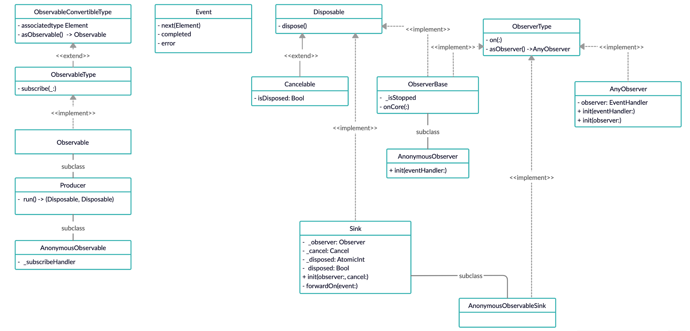

## RxSwift 源码阅读-其一

```swift
exsample("hello") {
    let disposeBag = DisposeBag()
    
    Observable.create { observer -> Disposable in
     	  observer.onNext("Hello World")
        observer.onCompleted()
        observer.onNext("Hello again")
    }
    .subscribe { event in
        print(event)
    }
    .disposed(by: disposeBag)
}
```

上面的代码运行无误的话，最终会在你的 Console 中打印出：

```
next(Hello World)
completed
```

本篇就从这个例子开始，从源码的角度解释上面这段代码的原理。

### 开始之前

- 代码以 RxSwift 5.0.1 为准
- 本文假设你有使用 RxSwift 的经验
- 本文所列举的源码都略去了用来 Debug，泛型以及注释的部分，完整的源码可以直接在 GitHub 上找到

### Observer

Observer 翻译过来就是观察者，而其观察的对象便是 Observable。关于 Observable 为何物，后文会讲到，首先我们先将注意力放在 Observer 身上。Observer 的起点是 ObserverType，以下是它的定义：

```swift
public protocol ObserverType {
    associatedtype Element
	
    func on(_ event: Event<Element>)
}
```

可以看出 ObserverType 只有一个职责，那就是响应 Event。

在继续说 ObserverType 之前，我们先绕道看一下 Event。Event 本身的定义很简单，只是一个代表了 next | completed | error 的 enum，并提供了一些 API 便于快速获取事件中的数据以及判断事件的类型。在看源码的时候发了个细节， Event 本身遵循了另一个协议： EventConvertible。这个协议和 Event 很像，关于为什么还要额外定义一个协议，这个我们后续再说，这里先（懒）略（得）过（看），以后再讲。

继续说回 ObserverType，这个类型同时还定义了 `onNext(_:)`，`onCompleted()`，`onError(_:)`方法，其实只是对上面的 `on(_:)` 方法的一层简单封装，这里就不再多赘述。

通过搜索代码，我们能够得到 ObserverType 的一个大致的关系链：ObserverType -> ObserverBase -> AnonymousObserver。

我们先来看 ObserverBase，其本身的定义也非常简洁：

```swift
class ObserverBase<Element> : Disposable, ObserverType {
    private let _isStopped = AtomicInt(0)

    func on(_ event: Event<Element>) {
        switch event {
        case .next:
            if load(self._isStopped) == 0 {
                self.onCore(event)
            }
        case .error, .completed:
            if fetchOr(self._isStopped, 1) == 0 {
                self.onCore(event)
            }
        }
    }

    func onCore(_ event: Event<Element>) {
        rxAbstractMethod()
    }

    func dispose() {
        fetchOr(self._isStopped, 1)
    }
}
```

ObserverBase 作为一个基类，把 ObserverType 定义的处理 Event 的一些通用的逻辑统一到了一处地方，同时提供了一个`onCore(:_)`方法，`on(:_)`方法里还是会把 event 转给这个方法，子类通过实现这个方法来处理事件。其实 RxSwift 还有一些地方也会采用这样的设计：提供一个基类遵循某个协议，基类实现协议定义的方法，将通用的逻辑放在里面，并另外提供一个类似方法给子类重写，这样在实现子类的时候就不需要关心那部分通用的逻辑，只需要实现自己特有的那部分行为就可以。后面讲到的 Producer 就是这样的一个例子。

从上面的代码片段可以看到，ObserverBase 内部使用了一个AtomicInt 类型 `_isStopped`来记录状态。那 AtomicInt 为何物呢，我们先绕道去看一下它的定义：

``` swift
final class AtomicInt: NSLock {
    fileprivate var value: Int32
    public init(_ value: Int32 = 0) {
        self.value = value
    }
}

@discardableResult
@inline(__always)
func add(_ this: AtomicInt, _ value: Int32) -> Int32 {
    this.lock()
    let oldValue = this.value
    this.value += value
    this.unlock()
    return oldValue
}

@discardableResult
@inline(__always)
func sub(_ this: AtomicInt, _ value: Int32) -> Int32 {
    this.lock()
    let oldValue = this.value
    this.value -= value
    this.unlock()
    return oldValue
}

@discardableResult
@inline(__always)
func fetchOr(_ this: AtomicInt, _ mask: Int32) -> Int32 {
    this.lock()
    let oldValue = this.value
    this.value |= mask
    this.unlock()
    return oldValue
}

@inline(__always)
func load(_ this: AtomicInt) -> Int32 {
    this.lock()
    let oldValue = this.value
    this.unlock()
    return oldValue
}
```

可以看到 AtomicInt 本质只是一个 NSLock，里面包了一个 Int32 类型的 value，其提供的接口都是都是对这个 value 进行操作，并用锁保证是线程安全的，并且这些方法的返回值都是被调用前的 value 值。

但是为什么不直接用一个 Bool，而是要额外定义这一个类型，而且 API 的设计咋一看也有点奇怪，为什么都是返回的旧值？于是去翻了一下 commit 记录，发现 AtomicInt 之前的定义并不是这样的，原本的 AtomicInt 类型是在`RxAtomic.h`中通过宏定义出来的，其本身也是只对 stdatomic.h 的封装，使用不加锁的方式实现在多个线程中共享数据。后来 RxAtomic 从 RxSwift 中独立了出去，才改成了现有的使用锁的实现方式。其实如果熟悉 lock free programming 的话，这些 API 看上去就不陌生了。

在了解了 AtomicInt 的实现后，让我们继续看回 ObserverBase 的 `on(:_)` 方法。在一个 next 事件过来时，会先检查 isStopped 的状态，如果是 0，那就会继续处理 next 事件，但是如果是 1，next 事件会被丢弃。如果 error | completed 事件第一次过来，会先把 isStopped 置为 1，并且返回的是置 1 前的 0，此时会处理当前事件，当 error | completed 再次到来时，还是会先把 isStopped 置为 1，但是返回的是 1，此时当前事件也会被直接丢弃掉。至此之后不管再有什么类型的事件过来，ObserverBase 及其子类都不会再响应了。这也是 RxSwift 从抽象层面上实现终止事件后 Observable 就不再有新的事件过来的原理。// TODO: 其他 ObserverType 也有这种方法，不是所有都继承自 Base

让我们再把目光放到 AnonymousObserver 上，去除了一些 debug 的逻辑，其定义如下：

```swift
final class AnonymousObserver<Element>: ObserverBase<Element> {
    typealias EventHandler = (Event<Element>) -> Void
    
    private let _eventHandler : EventHandler
    
    init(_ eventHandler: @escaping EventHandler) {
        self._eventHandler = eventHandler
    }

    override func onCore(_ event: Event<Element>) {
        return self._eventHandler(event)
    }
}
```

AnonymousObserver 的定义非常简单，在创建时传入 EventHandler，内部会持有它，每当观察到新的事件时，便会使用传入的 EventHandler 来处理事件。

还有一个不得不说的 Observer 类型：AnyObserver。从名字可以看出来，AnyObserver 是用来做类型擦除的，其定义如下：

```swift
public struct AnyObserver<Element> : ObserverType {
    public typealias EventHandler = (Event<Element>) -> Void

    private let observer: EventHandler

    public init(eventHandler: @escaping EventHandler) {
        self.observer = eventHandler
    }
    
    public init<Observer: ObserverType>(_ observer: Observer) where Observer.Element == Element {
        self.observer = observer.on
    }
    
    public func on(_ event: Event<Element>) {
        return self.observer(event)
    }
    
    public func asObserver() -> AnyObserver<Element> {
        return self
    }
}
```

AnyObserver 可以用 EventHandler 或这个 Observer 来初始化，其实现也非常简单，这里就不赘述了。另外这里还有一个 `asObserver()` 的方法，原定义是在同一个源文件 ObserverType 的扩展中：

```swift
extension ObserverType {
    public func asObserver() -> AnyObserver<Element> {
        return AnyObserver(self)
    }
}
```

这个方法的默认实现会把具体的 Observer 的类型给抹掉，然后返回一个统一的 AnyObserver，而 AnyObserver 的`asObserver()`会直接返回自己。

### Disposable and Cancelable

在说 Observable 之前，我们先来说一下 Disposable 和 Cancelable，以下是它们的定义：

```swift
public protocol Disposable {
    func dispose()
}

public protocol Cancelable : Disposable {
    var isDisposed: Bool { get }
}
```

Disposable 的定义非常简单，只有一个`dispose()`方法，定义了释放资源的行为，而 Cancelable 只是在Disposable 的基础上多了一个是否已经 dispose 的状态。

Disposable 在后面再继续讲，这里先把定义放出来，有一个感性的认识先。

### Observable

先简单说一下 Observable，这里一次性把 Observable 相关的定义都列举出来了：

```swift
public protocol ObservableConvertibleType {
    associatedtype Element

    func asObservable() -> Observable<Element>
}

public protocol ObservableType : ObservableConvertibleType {
     func subscribe<Observer: ObserverType>(_ observer: Observer) -> Disposable where Observer.Element == Element
}

extension ObservableType {
    public func asObservable() -> Observable<Element> {
        return Observable.create { o in
            return self.subscribe(o)
        }
    }
}

public class Observable<Element> : ObservableType {
    public func subscribe<Observer: ObserverType>(_ observer: Observer) -> Disposable where Observer.Element == Element {
        rxAbstractMethod()
    }
    
    public func asObservable() -> Observable<Element> {
        return self
    }
}
```

从这里可以看出这个几个类型的关系：Observable -> ObservableType -> ObservableConvertibleType。Observable 最主要的一个职责便是被 Observer 订阅，也就是让 Observer 能够接收到事件。初次接触可能会觉得有点违反直觉，因为第一感觉应该是 Observer 订阅 ObservableType，为什么这里的接口设计会和直觉反过来？一开始看代码的时候，这个方法名着实让我纠结了很久，最后我放弃了钻牛角尖，可能这真的只是一个名字，完全可以把 subscribe 换成 add，最后就变成了 Observable add Observer，这样就是大家所熟知的观察者模式了。

ObservableType 遵循了  ObservableConvertibleType 协议，并提供了 ObservableConvertibleType 默认实现：将具体的 ObservableType 类型包在了一个新的 Observable 里，这个新 Observable 会把 observer 直接传给当前的 ObservableType 订阅。而 Observable 的实现是直接返回自己。可以看出来 Observable 的主要职责还是将 ObservableType 的类型擦掉，同时也是众多不同类型的 Observable 的抽象基类，每一个具体的 Observable 会各自实现 `subscribe(:_)`方法。

###  Sink

Sink 翻译成中文就是下沉，水槽。如果把 Observable 比成流，那 Sink 就是加工流的地方化。可以说 Sink 是 RxSwift 实现 chaining operator 的基础，但是这个不是本文的重点，后面我们讲操作符的时候会着重讲这方面，今天先略过。我们先来看 Sink 的定义：

``` swift
class Sink<Observer: ObserverType> : Disposable {
    fileprivate let _observer: Observer
    fileprivate let _cancel: Cancelable
    private let _disposed = AtomicInt(0)

    init(observer: Observer, cancel: Cancelable) {
        self._observer = observer
        self._cancel = cancel
    }

    final func forwardOn(_ event: Event<Observer.Element>) {
        if isFlagSet(self._disposed, 1) {
            return
        }
        self._observer.on(event)
    }

    final var disposed: Bool {
        return isFlagSet(self._disposed, 1)
    }

    func dispose() {
        fetchOr(self._disposed, 1)
        self._cancel.dispose()
    }
```

Sink 本身是一个 Disposable，初始化 Sink 需要提供一个 Observer 和 Cancelable，Sink 内部会持有它们，从定义可以看出，Sink 更多只是一个 Wrapper，封装了 Observer 和 Cancelable，本身不处理 Event，而是转发给 Observer，但是在转发之前也是会判断是否已经 dispose 了，如果已经 dispose 了，不会再转发 Event。而`dispose` 也只是简单调用 Cancelable 的 `dispose` 方法，同时还加上了保证只会 dispose 一次的逻辑。这里还是用的 AtomicInt 来做标记，关于 AtomicInt 可以看前面 ObserverBase 部分。

后面我们可以看到，并不是所有 Observer 都是继承自 ObserverBase 的，所以需要在别的地方也有类似逻辑保证 响应完第一个终止事件后，后续的事件不会再继续被响应。这里的 Sink 就是做了这件事。

### Producer

RxSwift 几乎所有预定好的具体 Observable 子类都不是直接继承自 Observable 的，而是继承自 Producer，而 Producer 是直接继承自 Observable。而 Producer 是与 Sink 密不可分的一个角色，我们现在先来看看 Producer 的定义：

```swift
class Producer<Element> : Observable<Element> {
    override init() {
        super.init()
    }

    override func subscribe<Observer: ObserverType>(_ observer: Observer) -> Disposable where Observer.Element == Element {
      // 去掉了 Scheduler 部分的代码
      let disposer = SinkDisposer()
      let sinkAndSubscription = self.run(observer, cancel: disposer)
      disposer.setSinkAndSubscription(sink: sinkAndSubscription.sink, subscription: sinkAndSubscription.subscription)
      return disposer
    }

    func run<Observer: ObserverType>(_ observer: Observer, cancel: Cancelable) -> (sink: Disposable, subscription: Disposable) where Observer.Element == Element {
        rxAbstractMethod()
    }
}
```

从定义我们可以看出，Producer 重写了`subscribe(:_)`方法，并另外提供了一个 `run(_:cancel:)`方法供子类实现，和 ObserverBase 一样的设计思想，Producer 作为基类，将通用的逻辑放在了一起，并另外提供了新方法给子类。现在可以简单理解为 `run(_:cancel:)` 就是每一个 Producer 子类的`subscribe(:_)`方法。

在 Producer 的`subscribe(:_)` 方法里出现了一个 SinkDisposer 的东东，我们先转去看一下它是做什么的。以下是 SinkDisposer 的定义：

```swift
private final class SinkDisposer: Cancelable {
    private enum DisposeState: Int32 {
        case disposed = 1
        case sinkAndSubscriptionSet = 2
    }

    private let _state = AtomicInt(0)
    private var _sink: Disposable?
    private var _subscription: Disposable?

    var isDisposed: Bool {
        return isFlagSet(self._state, DisposeState.disposed.rawValue)
    }

    func setSinkAndSubscription(sink: Disposable, subscription: Disposable) {
        self._sink = sink
        self._subscription = subscription

        let previousState = fetchOr(self._state, DisposeState.sinkAndSubscriptionSet.rawValue)
        if (previousState & DisposeState.sinkAndSubscriptionSet.rawValue) != 0 {
            rxFatalError("Sink and subscription were already set")
        }

        if (previousState & DisposeState.disposed.rawValue) != 0 {
            sink.dispose()
            subscription.dispose()
            self._sink = nil
            self._subscription = nil
        }
    }

    func dispose() {
        let previousState = fetchOr(self._state, DisposeState.disposed.rawValue)

        if (previousState & DisposeState.disposed.rawValue) != 0 {
            return
        }

        if (previousState & DisposeState.sinkAndSubscriptionSet.rawValue) != 0 {
            guard let sink = self._sink else {
                rxFatalError("Sink not set")
            }
            guard let subscription = self._subscription else {
                rxFatalError("Subscription not set")
            }

            sink.dispose()
            subscription.dispose()

            self._sink = nil
            self._subscription = nil
        }
    }
}
```

SinkDisposer 遵循 Cancelable，内部依然使用 AtomicInt 记录状态，

先看它的`setSinkAndSubscription(sink:,subscription:)`方法，如果第一次调用，previousState 是 0，此时后面两个 if 的逻辑都不会走到，sink 和 subscription 正常设置上，并且此时 _state 变成了 sinkAndSubscriptionSet，在没 dispose 之前，如果重复调用该方法，是会走到 fatalError 的，这一般是逻辑错误，我们先不管。如果 _state 变成了 disposed，也就是`dispose()`方法被调用过，再调用`setSinkAndSubscription(sink:,subscription:)`会直接把 sink 和 subscription 都 dispose 掉并释放掉应用。可以理解为订阅一个已经结束了的 Observable，订阅会直接结束。（但是要注意的是，本文例子中的 Observable 是一个冷 Observable，重复订阅会重复运行 Observer 的逻辑的，也就是会再次打印出那两行结果出来）

`dispose()`方法也是差不多的原理，保证只有第一次调用是有效的，后续的调用什么事情都不会发生，因为调用方可以手动提前 dispose。

知道了 SinkDisposer 之后，我们再来看会 Producer。每当一个 Producer 被订阅，都会生成一个新的 sinkDisposer 实例，最终返回的也是这个实例。这个也正是我们开头的例子中调用完 `subscribe(_:)` 返回的那个 Disposable 的实例。

这里还有一个  `run(_:cancel:)`方法我们先留个悬念，等等再回来讲，不过可以先留意一下，刚刚初始化的 SinkDisposer 实例是作为该方法的第二个参数传了进去。

### 从点到线

一个个的点已经差不多有了，我们现在可以回到最开始的那个例子，开始探索原理了。

例子中的`subscribe`方法实现如下：

```swift
extension ObservableType {
    public func subscribe(_ on: @escaping (Event<Element>) -> Void) -> Disposable {
        let observer = AnonymousObserver { e in
            on(e)
        }
        return self.asObservable().subscribe(observer)
    }
```

可以看到，为什么基于观察者模式的 RxSwift 我们在写相关代码是从来都不用创建观察者的原因，就在于此：RxSwift 内部已经用你传入的闭包帮你创建好了一个匿名的 Observer，然后用这个 Observer 去订阅相应的 Observable。这个 Observer 也正是 Observeable.create 方法里的那个 observer 的来源。（请注意，这里说的是来源，create 闭包里的那个 observer 并不是直接使用的它，而是做了一些转换）

其实这个时候再看回例子中 Observable 的创建过程，可以得知，Observable 作为流或者数组的心智模型的本质就是 ObserverType 的 `on(_:)`的不停调用的过程，有了 Observer 才有了 Observable 的概念。

现在可以看回 Observable.create 的实现：

```swift
extension ObservableType {
    public static func create(_ subscribe: @escaping (AnyObserver<Element>) -> Disposable) -> Observable<Element> {
        return AnonymousObservable(subscribe)
    }
}
```

只有一行实现，简单的返回了一个 AnonymousObservable，从上面的经验我们可以直接猜出 AnonymousObservable 持有了 subscribe 闭包，然后在被订阅的时候调用这个闭包，传入上面我们所说的 AnonymousObserver。

八九不离十了，我们可以去看一下 AnonymousObservable 的定义了：

```swift
final private class AnonymousObservable<Element>: Producer<Element> {
    typealias SubscribeHandler = (AnyObserver<Element>) -> Disposable

    let _subscribeHandler: SubscribeHandler

    init(_ subscribeHandler: @escaping SubscribeHandler) {
        self._subscribeHandler = subscribeHandler
    }

    override func run<Observer: ObserverType>(_ observer: Observer, cancel: Cancelable) -> (sink: Disposable, subscription: Disposable) where Observer.Element == Element {
        let sink = AnonymousObservableSink(observer: observer, cancel: cancel)
        let subscription = _subscribeHandler(AnyObserver(sink))
        return (sink: sink, subscription: subscription)
    }
}

final private class AnonymousObservableSink<Observer: ObserverType>: Sink<Observer>, ObserverType {
    typealias Element = Observer.Element 
    typealias Parent = AnonymousObservable<Element>

    private let _isStopped = AtomicInt(0)

    override init(observer: Observer, cancel: Cancelable) {
        super.init(observer: observer, cancel: cancel)
    }

    func on(_ event: Event<Element>) {
        switch event {
        case .next:
            if load(self._isStopped) == 1 {
                return
            }
            self.forwardOn(event)
        case .error, .completed:
            if fetchOr(self._isStopped, 1) == 0 {
                self.forwardOn(event)
                self.dispose()
            }
        }
    }
}
```

AnonymousObservable 正式 Producer 的一个子类。同时我把 AnonymousObservableSink 的定义也贴出来了，因为 Producer 和 Sink 几乎是成双成对出现的。值得注意的是，和 Producer 一起出现的 Sink 类型除了继承自上文说的 Sink 之外，本身还是遵循了 ObserverType 的，也就是说它本身就是一个 Observer。（为了进行区分，下文把这里的 Sink 称为 ProducerSink）

AnonymousObservableSink 实现非常简单，把事件传给了持有 observer，同时在 dispose 的时候会把持有的 cancel 给 dispose 掉。

再看回 AnonymousObservable，在它的 `run(_:cancel:)` 实现里，会初始化一个 AnonymousObservableSink 实例，最后用 AnyObserver 把这个 sink 类型抹掉，然后传给了 `_subscribeHandler`，也就是 Observable.create 闭包里的那个 observer 的真正身份。最终通过一级级封装，走到了我们例子中的`print(event)`，打印了前两个事件。

再来看看 AnonymousObservableSink 所持有的 cancel 是谁。从 Producer 的源码就可以看出，这里的 cancel 就是 sinkDisposer，上文已经说过，sinkDisposer 就是调用方得到的那个 Disposable。当终止事件首次到来，也就是流已经结束了，所以这里把 sinkDisposer 也 dispose 掉，至此这个订阅已经结束了，资源被自动释放。

现在可以继续`run(_:cancel:)` 了。这个方法会返回一个含有两个元素的 tuple，都是 Disposable，现在这两个 Disposable 具体是用来干啥的就非常清楚了：

第一个是 RxSwift 内部完成订阅流程而创建出来的 Disposable。

第二个是创建 Observerable 时返回的那个 Disposable。

调用方最终拿到的就是把这两个 Disposable 放在一起统一处理的 Disposable。

### 再探 Disposable

在创建 Observable 时可能会需要一些额外的资源才能使得一个 Observable 有新的数据过来，比如网络请求，Disposable 就是这些资源的一种抽象表示，提供了清理/释放资源的机会。同时对外而言它也代表了订阅（subscription）的概念。取消订阅的本质就是提前释放资源，Observer 不再响应事件。

RxSwift 里会自动帮你调用 Disposable 的方法，但是当业务很复杂，Observable 可能会源源不断有新的事件过来，或者网络很慢，请求很久都没有回来的时候，我们想要统一的管理这些订阅，例如在用户退出界面时能够自动取消掉当面订阅，释放资源。一种方式是把每一个订阅都记录下来，在 deinit 的时候手动一个个调用 dispose 方法。如果一个高度使用 RxSwift 的页面这么做显示是不合理的，所以 RxSwift 还提供了一个 DisposeBag：

```swift
public final class DisposeBag: DisposeBase {
    
    private var _lock = SpinLock()
    
    fileprivate var _disposables = [Disposable]()
    fileprivate var _isDisposed = false
   	
    public func insert(_ disposable: Disposable) {
        self._insert(disposable)?.dispose()
    }
    
    private func _insert(_ disposable: Disposable) -> Disposable? {
        self._lock.lock(); defer { self._lock.unlock() }
        if self._isDisposed {
            return disposable
        }

        self._disposables.append(disposable)

        return nil
    }

    private func dispose() {
        let oldDisposables = self._dispose()

        for disposable in oldDisposables {
            disposable.dispose()
        }
    }

    private func _dispose() -> [Disposable] {
        self._lock.lock(); defer { self._lock.unlock() }

        let disposables = self._disposables
        
        self._disposables.removeAll(keepingCapacity: false)
        self._isDisposed = true
        
        return disposables
    }
    
    deinit {
        self.dispose()
    }
}
```

当对一个 Disposable 对象调用 `disposed(by:)`方法是，便是将该 Disposable 插入到了传入的 DisposeBag 对象中，与 DisposeBag 对象的生命周期绑定到了一起，在该实例被释放时，会遍历所有持有的 Disposable 并调用`dispose()`方法释放资源。

从源码中可以发现一个 DisposeBag 对象只能 dispose 一次，当向已经 dispose 的 DisposeBag 对象插入新的 Disposable 对象时，该对象会被立即 dispose 掉。另外值得注意的是，这里使用了递归锁，因为有可能会在同一个线程内多次调用`insert(:_)`方法，防止线程被锁死。在 Disposables 目录下还定义了其它几个类型的 Disposable，实现各自不同的释放行为。

### 总结

初看 RxSwift 的代码，真的非常需要耐心，因为里面涉及到了很多抽象。这些抽象光从本文的角度看，会觉得有点过度设计，但其实这些是为了其他还没讲到的部分设计的。并且 RxSwift 里面还是有很多值得学习的地方的：

- Disposable 的设计就是”针对接口编程，而不是针对实现编程“的典型例子，所有相关代码相关都是针对 Disposable，而不会接受具体某一种 Disposable 类型而写的。
- 每一个类型的职责都非常简单，例如 Observable -> ObservableType -> ObserbaleConvertibleType，每一个协议之规定了一个职责，在具体的实现了只关注自己的职责部分，把关注点分割到最小。
- 使用 AtomicInt 优美的处理不同的情况。

最后附上自己整理的本文相关的类关系图：



### 参考资料

- [ReactiveX/RxSwift: Reactive Programming in Swift](https://github.com/ReactiveX/RxSwift)

- [【领略RxSwift源码】- 订阅的工作流（Subscribing）](https://www.jianshu.com/p/af17ba8e5d14)
